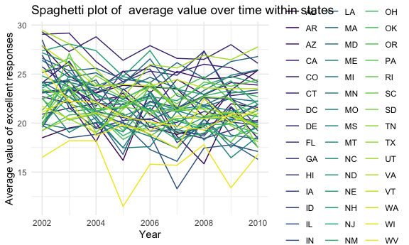

p8105_hw3_jl6647
================
Jiatong LI
2023-10-05

``` r
library(tidyverse)
```

    ## ── Attaching core tidyverse packages ──────────────────────── tidyverse 2.0.0 ──
    ## ✔ dplyr     1.1.3     ✔ readr     2.1.4
    ## ✔ forcats   1.0.0     ✔ stringr   1.5.0
    ## ✔ ggplot2   3.4.3     ✔ tibble    3.2.1
    ## ✔ lubridate 1.9.2     ✔ tidyr     1.3.0
    ## ✔ purrr     1.0.2     
    ## ── Conflicts ────────────────────────────────────────── tidyverse_conflicts() ──
    ## ✖ dplyr::filter() masks stats::filter()
    ## ✖ dplyr::lag()    masks stats::lag()
    ## ℹ Use the conflicted package (<http://conflicted.r-lib.org/>) to force all conflicts to become errors

``` r
library(ggridges)
library(p8105.datasets)
library(dplyr)
```

``` r
knitr::opts_chunk$set(
  fig.width = 6,
  fig.asp = 0.6,
  out.width = "90%"
)
theme_set(theme_minimal() + theme(legend.position = "bottom")) 
options(
  ggplot2.continuous.colour = "viridis",
  ggplot2.continuous.fill = "viridis"
)
scale_colour_discrete = scale_color_viridis_d
scale_fill_discrete = scale_fill_viridis_d
```

## HW3 Problem 1

``` r
data("instacart")
```

The goal is to do some exploration of this dataset. To that end, write a
short description of the dataset, noting the size and structure of the
data, describing some key variables, and giving illstrative examples of
observations.

##### Some description:

This dataset `instacart` has 1384617 rows and 15 columns, with each row
representing a single product from an order. Variables all related to
orders or products. For example, variables like `product_name`, `aisle`,
`department` are related to the information of products.

Key variables include order_id, product_id, add_to_cart_order,
reordered, user_id, eval_set, order_number, order_dow,
order_hour_of_day, days_since_prior_order, product_name, aisle_id,
department_id, aisle, department.

##### Questions:

\*1.How many aisles are there, and which aisles are the most items
ordered from?

``` r
aisles_num = 
  instacart |> 
  group_by(aisle_id) |> 
  summarize(n_products = n()) 
```

``` r
most_iterms = 
  instacart |> 
  group_by(aisle) |> 
  summarize(n_products = n()) |> 
  mutate(rank_aisle = min_rank(desc(n_products))) |> 
  arrange(rank_aisle) |> 
  filter(rank_aisle == 1) |> 
  pull(aisle)
```

There’re 134 aisles. fresh vegetables is the aisles the most iterms
ordered from.

\*2.Make a plot that shows the number of items ordered in each aisle,
limiting this to aisles with more than 10000 items ordered. Arrange
aisles sensibly, and organize your plot so others can read it.

## HW3 Problem 2: BRFSS

``` r
data("brfss_smart2010")
```

### Data cleaning:

format the data to use appropriate variable names;

focus on the “Overall Health” topic

include only responses from “Excellent” to “Poor”

organize responses as a factor taking levels ordered from “Poor” to
“Excellent”

``` r
brfss_df = 
  brfss_smart2010 |>
  janitor::clean_names() |> 
  filter(
    topic == "Overall Health",
    response %in% c("Excellent","Very Good","Good","Fair","Poor")
  ) |>
  mutate(
    response = factor(
      response,
      levels = c("Poor","Fair","Good","Very Good","Excellent"),
      ordered = TRUE
    )
  ) |> 
  separate(
    col = locationdesc,
    into = c("state","county"),
    sep = "-",
    remove = TRUE
  ) |> 
  select(year,state,county,class,topic,question,response,sample_size,data_value,geo_location)
```

    ## Warning: Expected 2 pieces. Additional pieces discarded in 32 rows [249, 250, 251, 252,
    ## 1371, 1372, 1373, 1374, 2509, 2510, 2511, 2512, 3662, 3663, 3664, 3665, 4725,
    ## 4726, 4727, 4728, ...].

``` r
  view(brfss_df)
```

##### Answer questions

\*1.In 2002, which states were observed at 7 or more locations? What
about in 2010?

``` r
state_2002 = 
  brfss_df |> 
  filter(
    year == 2002,
    response == "Excellent") |> 
  group_by(year,state) |> 
  summarize(n_county = n()) |> 
  filter(n_county >=7) |> 
  pull(state)
```

    ## `summarise()` has grouped output by 'year'. You can override using the
    ## `.groups` argument.

``` r
state_2010 = 
  brfss_df |> 
  filter(
    year == 2010,
    response == "Excellent") |> 
  group_by(year,state) |> 
  summarize(n_county = n()) |> 
  filter(n_county >=7) |> 
  pull(state)
```

    ## `summarise()` has grouped output by 'year'. You can override using the
    ## `.groups` argument.

In 2002, the states observed at 7 or more locations are CT , FL , MA ,
NC , NJ , PA In 2010, the states observed at 7 or more locations are CA
, CO , FL , MA , MD , NC , NE , NJ , NY , OH , PA , SC , TX , WA

\*2.Construct a dataset that is limited to Excellent responses, and
contains, year, state, and a variable that averages the data_value
across locations within a state. Make a “spaghetti” plot of this average
value over time within a state (that is, make a plot showing a line for
each state across years – the geom_line geometry and group aesthetic
will help).

``` r
excellent_df =
  brfss_df |> 
  filter(response == "Excellent") |> 
  group_by(year,state) |> 
  summarize(avg_value = mean(data_value, na.rm = TRUE))
```

    ## `summarise()` has grouped output by 'year'. You can override using the
    ## `.groups` argument.

``` r
excellent_df
```

    ## # A tibble: 443 × 3
    ## # Groups:   year [9]
    ##     year state avg_value
    ##    <int> <chr>     <dbl>
    ##  1  2002 "AK "      27.9
    ##  2  2002 "AL "      18.5
    ##  3  2002 "AR "      24.1
    ##  4  2002 "AZ "      24.1
    ##  5  2002 "CA "      22.7
    ##  6  2002 "CO "      23.1
    ##  7  2002 "CT "      29.1
    ##  8  2002 "DC "      29.3
    ##  9  2002 "DE "      20.9
    ## 10  2002 "FL "      25.7
    ## # ℹ 433 more rows

``` r
excellent_plot =
  ggplot(
    excellent_df,
    aes(x = year, y = avg_value, color = state, group = state)) +
    geom_line() +
    theme_minimal() +
    labs(title = "Spaghetti plot: Average value of excellent responses over time within a state",
         x = "Year",
         y = "Average value of excellent responses")
excellent_plot
```



``` r
min_df = 
  excellent_df |> 
  filter(year == 2005)
view(min_df)
```

From the plot, it is clear to see that the plot of the state `WV` is
significantly different from other states, with low values in the year
of 2005 and 2009.

\*3.Make a two-panel plot showing, for the years 2006, and 2010,
distribution of data_value for responses (“Poor” to “Excellent”) among
locations in NY State.
